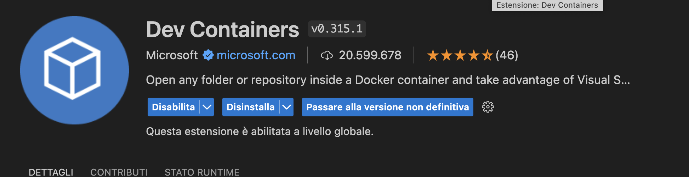
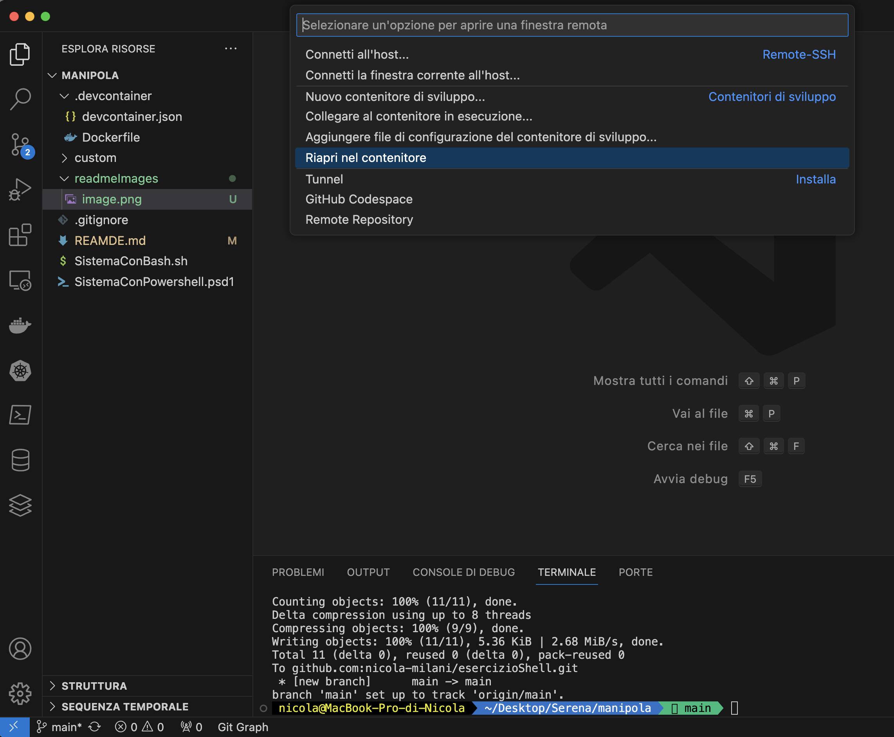

# Cose che fanno cose
Mettere l'export di articulate nella root di questa cartella

# os requirements
1. Su windows/macos Installare ("Docker Desktop")
[https://www.docker.com/products/docker-desktop/]
2. Avviare docker desktop
3. Installare Visual Studio Code https://code.visualstudio.com/Download 
4. Aprire la cartella del presente repository con Visual Studio Code
5. Controllare di aver installato l'estensione Dev Containers 
  
6. Avviare il devcontainer
   Apri finestra remota cliccando nell'angolo in basso a sinistra di visual studio code.

   Nel menu che si apre, selezionare "Riapri nel contenitore"


# Per lanciare lo script

```
source SistemaConBash.sh
```
# Uscire dal devcontainer
Apri finestra remote e clicca su "Riaprire cartella in locale"
# Devcontainer

Il devcontainer è definito per macbook m1. 

Su architettura amd64, sostituire "arm64" con "amd64" nel file Dockerfile presente nella cartella ".devcontainer"
NB: nel devcontainer non c'è il cestino